# Projekt

Da das aktuelle Nachtleben sehr unübersichtlich und untransparent gestaltet ist, haben wir uns überlegt eine App zu entwickeln, welche dem Ansatz des User-Center-Designs entspricht. Bis dato mussten sich User durch sämtliche Online-Plattformen wie Google, Facebook oder Instagram Informationen rund um Events oder Öffnungszeiten der jeweiligen Locations mühselig zusammensuchen. Dies wird jedoch oft erschwert, da auch die Informationen der diversen Locations und Veranstalter unterschiedlich angelegt sind. Manche nutzen Facebook, andere Instagram und wiederum andere ihre persönliche Webseite. Eine einheitliche Plattform o. Ä. ist auf diesem Gebiet noch nicht gegeben.
Aus diesen Gründen, wird in unserer App alles gebündelt und auf unterschiedliche Listen, wie z. B. der Locationliste oder einer Eventliste dargestellt. Diese werden wiederrum nach verschiedenen Kriterien strukturiert um die Nutzung so einfach und möglich gestalten zu können.
Zudem gelangen User über die oben genannten Listen in die jeweiligen Detailansichten, wo sie z. B. die Öffnungszeiten der Locations, oder auch eine detaillierte Beschreibung des anstehenden Events entnehmen können.
In einem speziell für den User entworfenen persönlichen Bereich, kann dieser diverse Events aber auch Locations abspeichern, um ein schnelles Wiederfinden gewährleisten zu können.
Somit haben wir den Aufwand seitens der User, sowohl für das Suchen von Veranstaltung oder Locations, als auch das Wiederfinden dieser, auf ein Minimum reduziert. 
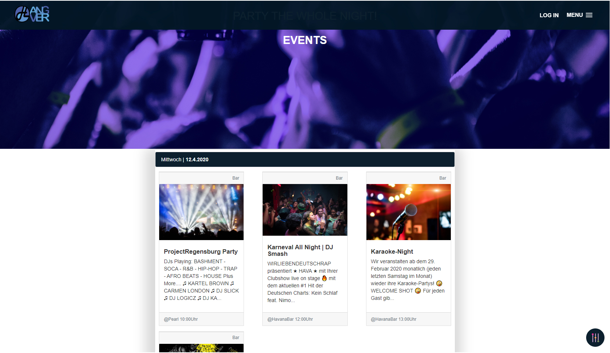
**Link zur bereitgestellten Online-Version: https://hangover-party-ef024.firebaseapp.com/**

## Team

|                                                                                 | Infos                                                                                                                            | Implementierte Komponenten                                    |
| ------------------------------------------------------------------------------- | -------------------------------------------------------------------------------------------------------------------------------- | ------------------------------------------------------------- |
|  | **Stefan Lippl** E-Mail: stefan.lippl@stud.uni-regensburg.de Github-Nutzer: swstudentrgb  Matrikelnummer: 2046000 | Eventliste, Locationliste, Event-Detail, Persönlicher Bereich |

|                                                                                       | Infos                                                                                                                                      | Implementierte Komponenten                                                |
| ------------------------------------------------------------------------------------- | ------------------------------------------------------------------------------------------------------------------------------------------ | ------------------------------------------------------------------------- |
|  | **Christoph Meyer** E-Mail: christoph.meyer@stud.uni-regensburg.de Github-Nutzer: christophmeyer13  Matrikelnummer: 2036571 | Location-Detail-Ansicht inkl. Header, Info, Events, Reviews & Bilder, Map |

## Setup und Testing

Im Starterpaket ist ein einfacher Webserver vorgegeben, mit dem Sie die Inhalte des Ordners `/app` statisch ausliefern können. Benutzen Sie diesen, um Ihre Anwendung zu entwickeln und zu testen. Sollten Sie zu Realisierung Ihrer Anwendung eine komplexere Serverkomponente benötigen, können Sie die vorhandenen Dateien (`index.js` und `lib/AppServer.js`) als Ausgangslage für eigene Erweiterungen nutzten. Speichern Sie alle weiteren, serverseitig verwendeten Dateien im Verzeichnis `/lib` ab.

So nutzen Sie den vorgegebenen Server:

1. Führen Sie **einmalig** den Befehl `npm install` aus, um die notwendigen Abhängigkeiten (`express`) zu installieren.

2. Führen Sie den Befehl `npm start` aus um die Anwendung zu starten. Der Inhalt des `/app`-Verzeichnis ist anschließend über die die Adresse `http://localhost:8000/app` erreichbar.

### Automatisches Bauen der Anwendung

Unter Umständen müssen oder wollen Sie vor dem Ausführen bzw. Bereitstellen Ihrer Anwendung bestimmte Optimierungsvorgänge durchführen (z.B. mehrere Javascript-Dateien zu einer zusammenfügen oder Grafikdateien für die Verwendung im Browser anpassen). Versuchen Sie diese Schritte mithilfe entsprechende _Node.js_-Module zu lösen und implementieren Sie die Automatisierung in der Datei `build.js`. Sie können diese Datei über den Befehl `npm run build` starten. Dabei wird vor dem Ausführen der Datei der Javascript-Code unter `app/resources/js/` auf Fehler und Warnungen (_eslint_) geprüft. Der automatisierte Bau der Software startet nur dann, wenn Ihr Code fehlerfrei ist.

## Beschreibung

### Event-/Location-Liste:

Die Event- und Location-Liste sollen einen groben Überblick über kommende Veranstaltungen bzw. Bars, Clubs, etc. bieten. Hierbei wurde explizit darauf geachtet, dass die Sortierung dieser leicht verständlich und übersichtlich ist. Events werden nach Datum, Locations nach Alphabet sortiert.  
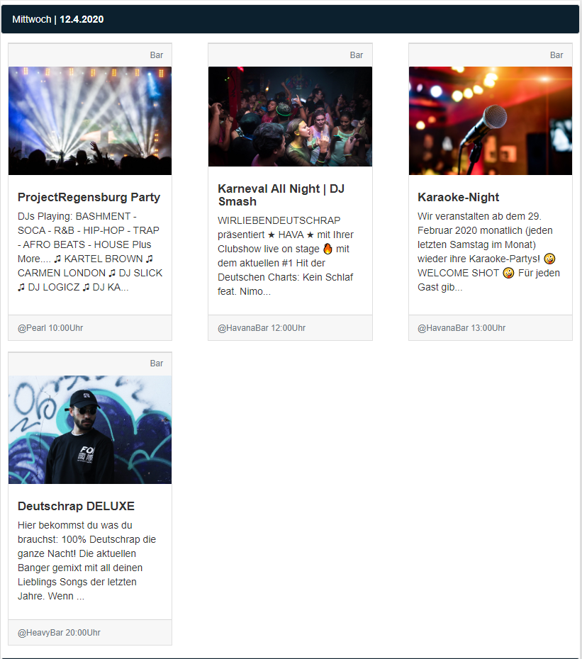
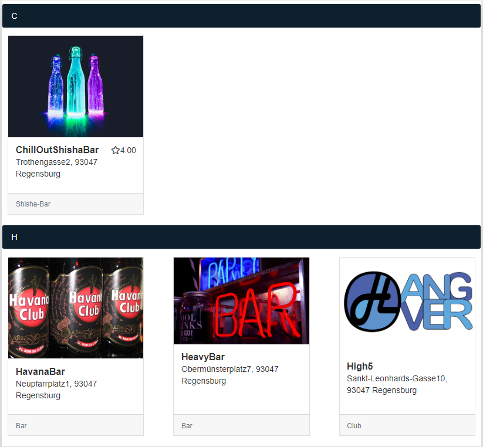
 

### Filter:

Sowohl Veranstaltungen, als auch Locations können nach verschiedenen Kriterien gefiltert werden. Das folgende Beispiel zeigt einen Filter der Veranstaltungsliste nach Art des Veranstalters.  
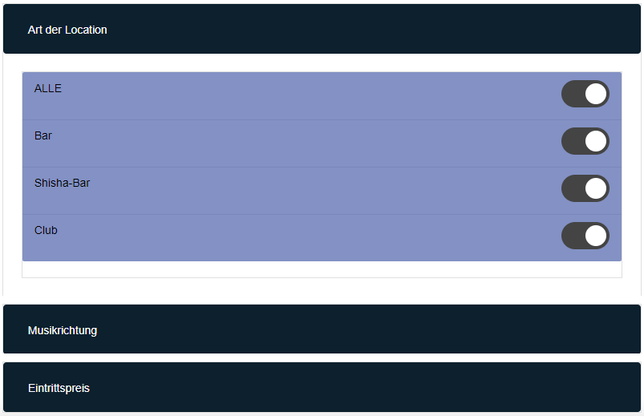
 

### Event-Detail-Ansicht:

Die Detailansicht von Events beinhaltet Breadcrumbs, die es Nutzern ermöglichen sollen, die Navigation zu vereinfachen, sowie einen Überblick über die aktuelle Position des Users zu vermitteln. Die Ansicht bietet außerdem Kennzahlen, wie Views und Likes einer Veranstaltung. Das Veranstaltungsbild ist noch einmal groß hinterlegt und man findet genauere Informationen zum Event in einer ausführlichen Beschreibung, eine Sektion für Startzeit, Eintrittspreis und gespielte Musik. Im Footer der Karte findet man den Veranstalter und hat die Möglichkeit das Event zu speichern.  
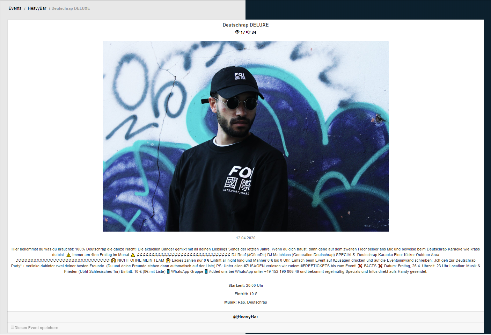
 

### Location-Detail-Ansicht:

Klickt man auf eine gewünschte Location aus der Liste, gelangt man in die Location Detailansicht. Diese verfügt über die meiste Funktionalität und ist wie Folgt aufgebaut:

Im Header findet man ein Bild der Location. Rechts davon wird der Name der Location sowie die Adresse gezeigt. Unter der Adresse werden kleine Statistiken angezeigt. Das „Auge“ zeigt dem Nutzer wie viele andere Nutzer diese Location bereits betrachtet haben. Das Message-Icon gibt eine Zahl an, wie viele Bewertungen (Reiter Bewertungen wird später vorgestellt) bereits abgeben wurden. Der Like-Icon zeigt, wie viele Nutzer sich diese Location bereits abgespeichert haben. Im Footer des Header Bereiches wird die Art der Location angegeben.
Im Folgenden werden die einzelnen Reiter der Location Detailansicht erläutert. 
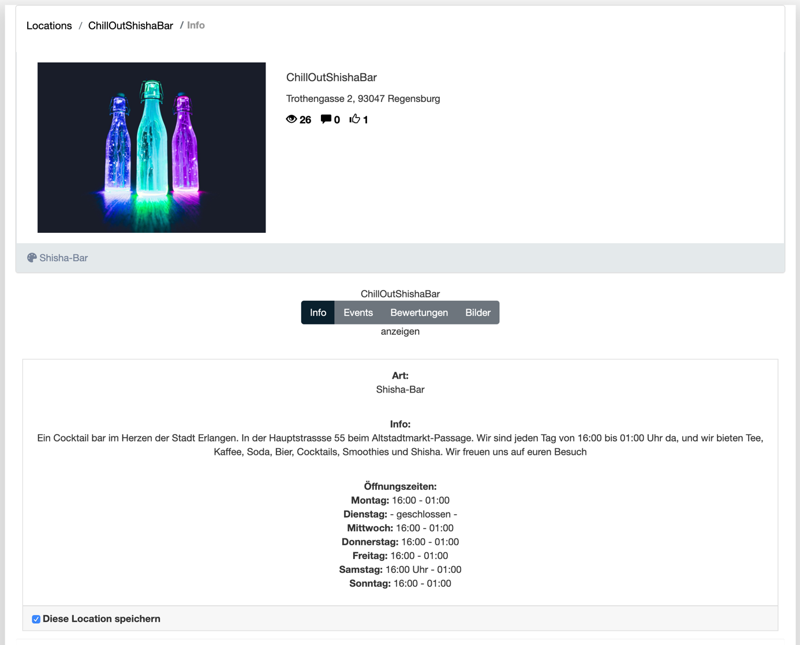
 

Im Reiter „Info“ kann der User allgemeine Informationen der Location einsehen. Hier kann der Betreiber der Location z. B. seine Art hinterlegen, generelle Informationen zur Location sowie die Öffnungszeiten eintragen.
Im Footer des Inforeiters ist eine Checkbox hinterlegt, mit welcher sich der User diese Location in den Persönlichen Bereich abspeichern kann. 

 

Im Reiter „Events“ werden wie auch in der Event Liste alle Events dieser Location, nach Datum sortiert, gelistet. 
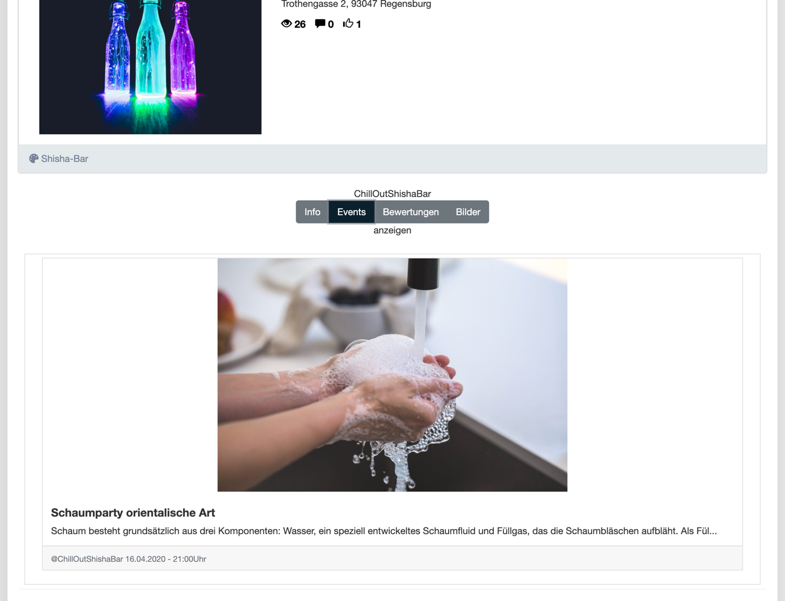
 

Im Reiter „Bewertungen“ können Nutzer Rezensionen hinterlegen. Sind bei einer Location noch keine Bewertungen vorhanden, wird der Text „Noch kein Review vorhanden. Jetzt Bewertung abgeben“ angezeigt. 
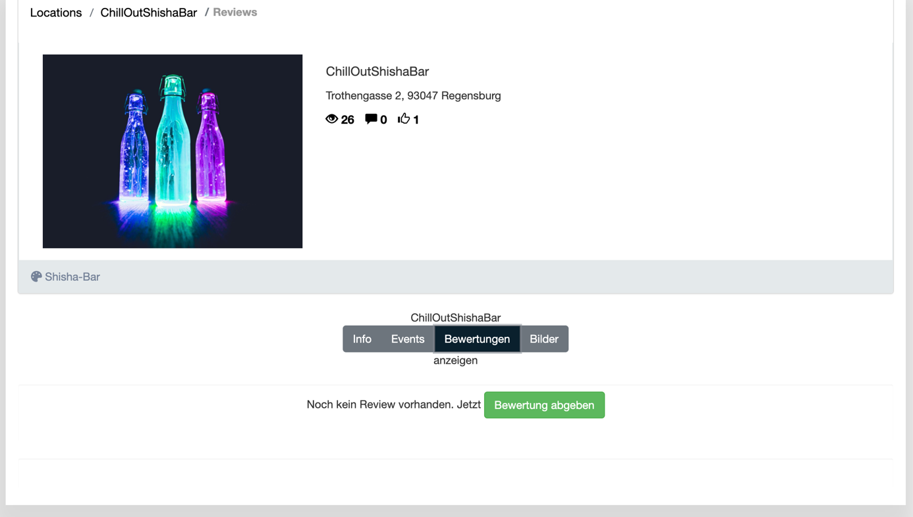
 

Um eine Bewertung abgeben zu können, muss der Benutzer mit seinem Google Konto eingeloggt sein. Ist dies nicht der Fall, wird er durch ein PopUp Fenster darauf hingewiesen.  
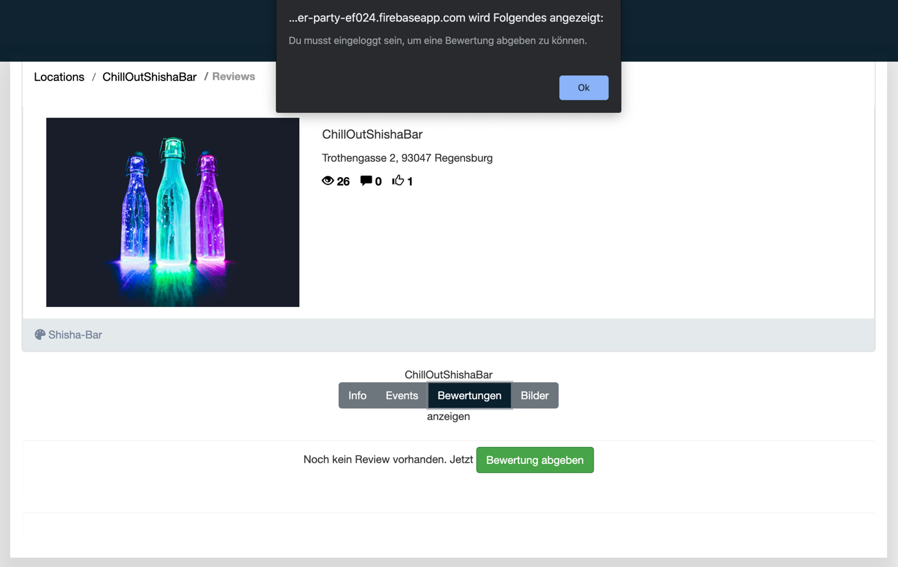
 

Im Bewertungsmodus kann der Nutzer zwischen 1 und 5 Sternen wählen. Zudem kann er einen Text angeben, mit welchem er die Location beschreibt. Pro Benutzer kann lediglich ein Review pro Location abgegeben werden.  
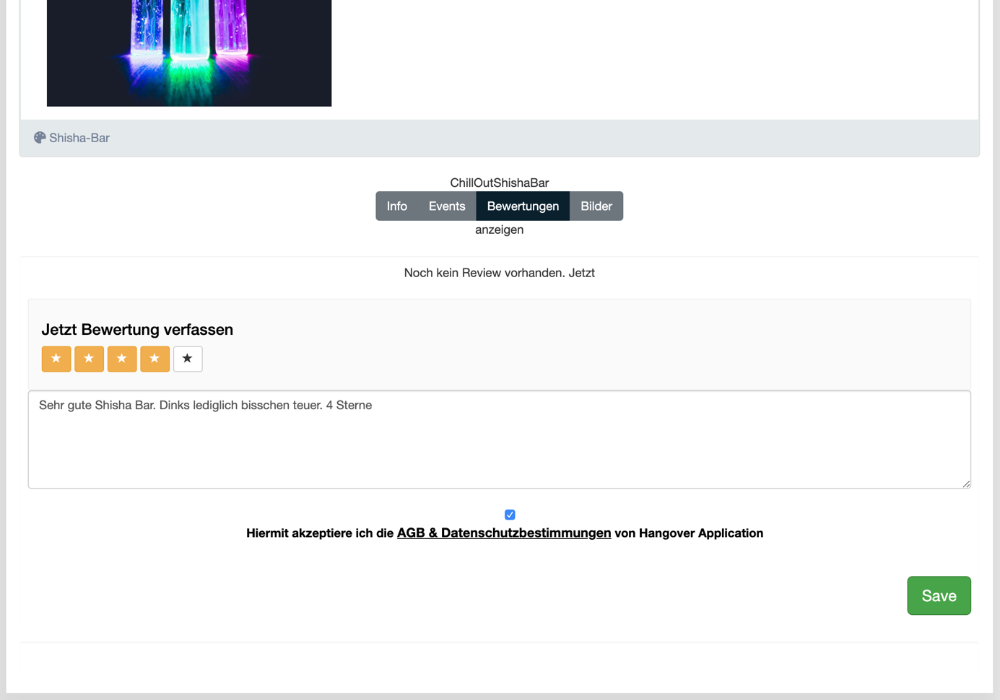
 

Der Nutzer muss durch ein setzen der Checkbox die AGB & Datenschutzerklärung akzeptieren. Ist das nicht der Fall, kann er die Bewertung nicht abschicken und wird durch ein PopUp darauf hingewiesen diese zu akzeptieren. 
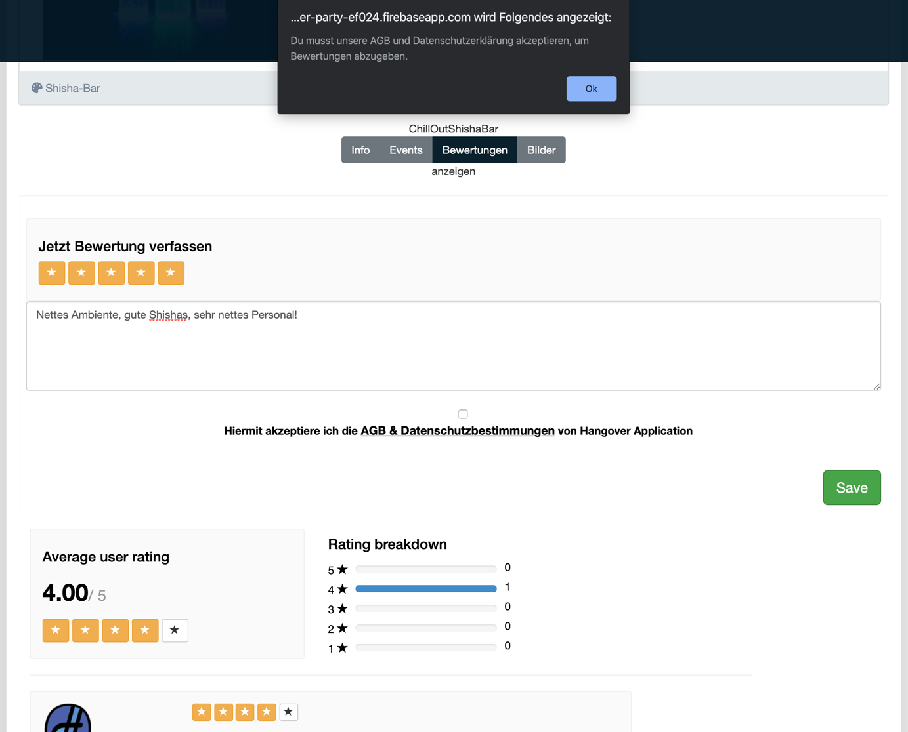
 

Sind bereits Bewertungen hinterlegt, werden diese durch eine Overall-Statistik am Head Bereich dargestellt. Auf der linken Seite wird eine Durchschnittliche Bewertung dargestellt. Auf der rechten Seite werden die einzelnen Bewertungen kategorisiert dargestellt. Den einzelnen Reviews können Nutzer sowohl ein Like als auch ein Dislike geben. Hierbei sollen gute von schlechten Reviews mit Hilfe der Community unterschieden werden. Ebenso kann ein Review gemeldet werden, falls es Content beinhaltet welche gegen die AGB & Datenschutzbestimmungen verstößt.  
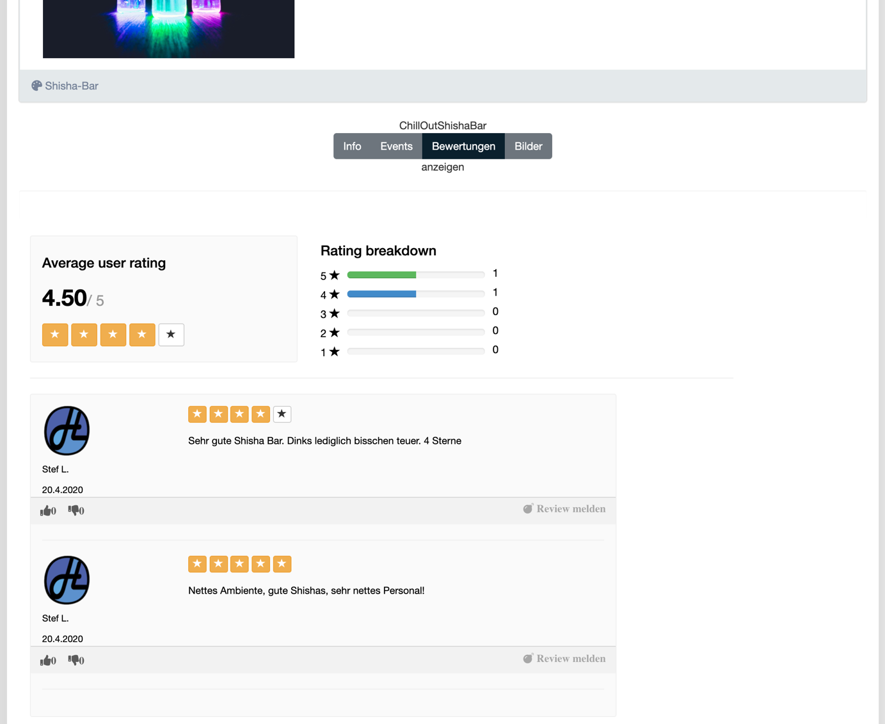
 

Im Reiter „Bilder“ können Nutzerbilder eingesehen werden, welche von User gemacht wurden. Hier gilt dasselbe Prinzip wie bei den Bewertungen. Ist noch kein Bild vorhanden wird der Text „Noch kein Bild vorhanden. Jetzt Bild hochladen“ angezeigt.  

 

Um zur Upload Form zu gelangen, muss der Nutzer auch wie bei den Reviews eingeloggt sein um ein Bild hochladen zu können. Hierbei kann er entweder durch den Button „Datei auswählen“ ein Bild auswählen, oder durch ein integriertes Drag&Drop Feld das gewünschte Foto einfach rüber ziehen. Ebenso muss er die AGB & Datenschutzbestimmungen akzeptieren um den Upload starten zu können.  
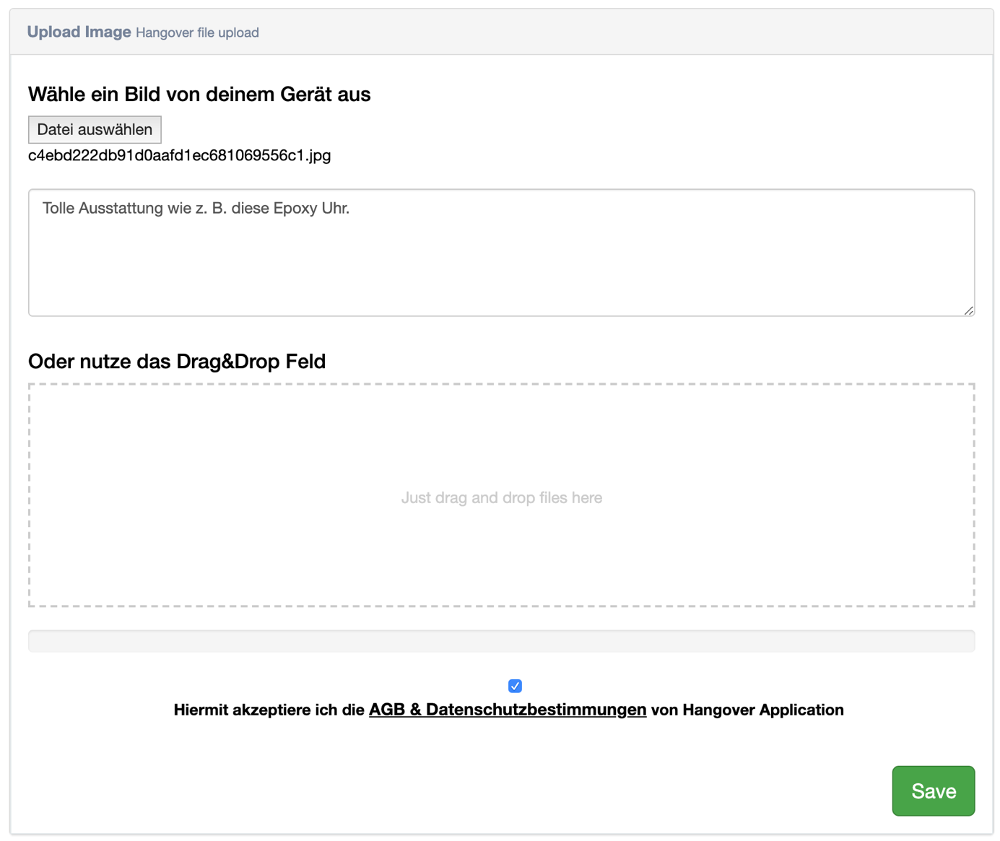
 

In der Liste werden alle hochgeladenen Bilder dargestellt. Die Beschreibung welche der Nutzer hinterlegt hat wird hierbei unter dem Bild im Footer dargestellt. Bilder verfügen wie auch Reviews über einen Like bzw. Dislike Button um besonders aussagekräftige Bilder zu stärken bzw. fehlplatzierte Bilder zu schwächen. Auch kann ein Bild welches gegen die AGB & Datenschutzbestimmungen verstößt gemeldet werden.  
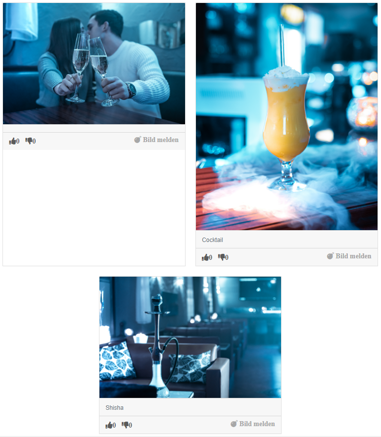
 

Durch einen Klick auf das jeweils gewünschte Bild, wird dies im nächsten Fenster in originaler Größe geladen. Durch den Zurück Button des Browsers kann der User wieder zur Location Detailansicht zurück gelangen.  
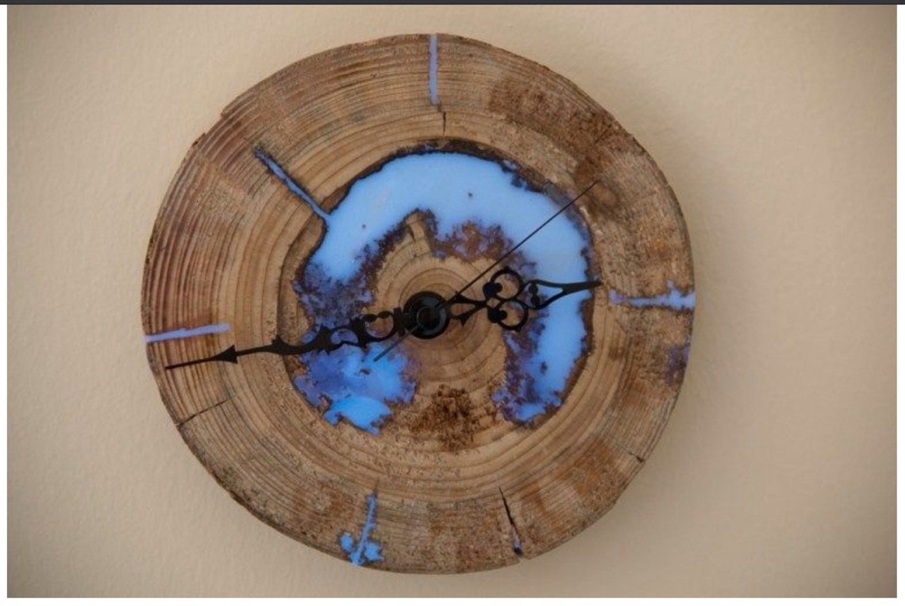
 

### Map:

Die Map-Funktion unserer Homepage bietet die Möglichkeit, alle Locations auf einer Interaktiven Karte darzustellen und mit diesen zu interagieren. Klick man auf einen Marker der Karte, öffnet sich eine Bubble, die die Kerninformationen der Location zusammenfasst. Die unterschiedlichen Typen von Locations werden mittels unterschiedlicher Farben der Marker veranschaulicht.  
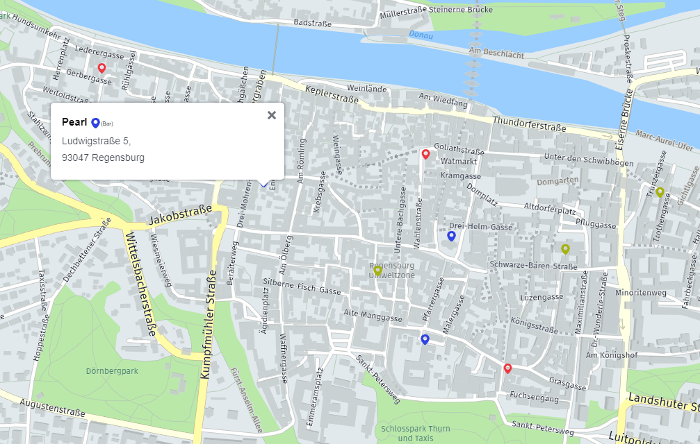

### Persönlicher Bereich:

Besucht man zum ersten Mal den Persönlichen Bereich der Webseite, erscheint eine Anzeige mit GoogleLogin-Button. Mit Hilfe dieses Buttons kann man sich auf unserer Seite anmelden.  
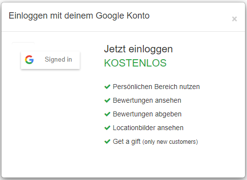
 

Ist man nun angemeldet, gelangt man auf den eigentlichen Persönlichen Bereich. Die Karte am oberen Rand unterhalb der Nav-Bar veranschaulicht den aktuell eingeloggten Benutzer. Dieser wird mit Bild, Namen und E-Mail-Adresse genannt. Des Weiteren befindet sich in dieser Karte (aber auch in der Nav-Bar) ein Logout-Button. Unter der Benutzer-Karte sieht man zwei Tabs. Der Tab „Event“ zeigt alle gespeicherten Events in gewohntem Design an und bietet Nutzern die Möglichkeit, direkt zur Event-Detail-Ansicht zu gelangen. Es besteht jederzeit die Möglichkeit ein gespeichertes Event aus dem Persönlichen Bereich zu entfernen.  
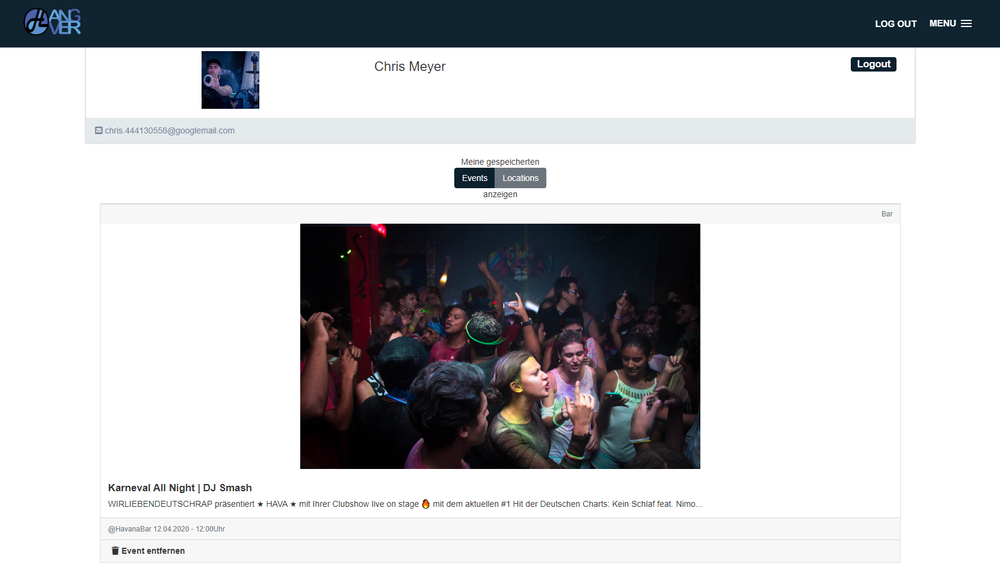
 

Wechselt man in den Reiter „Locations“ kann der User seine gespeicherten Bars/Clubs/etc. sehen. Diese werden ebenfalls in gewohntem Design präsentiert und können jederzeit aus der Liste entfernt werden.  
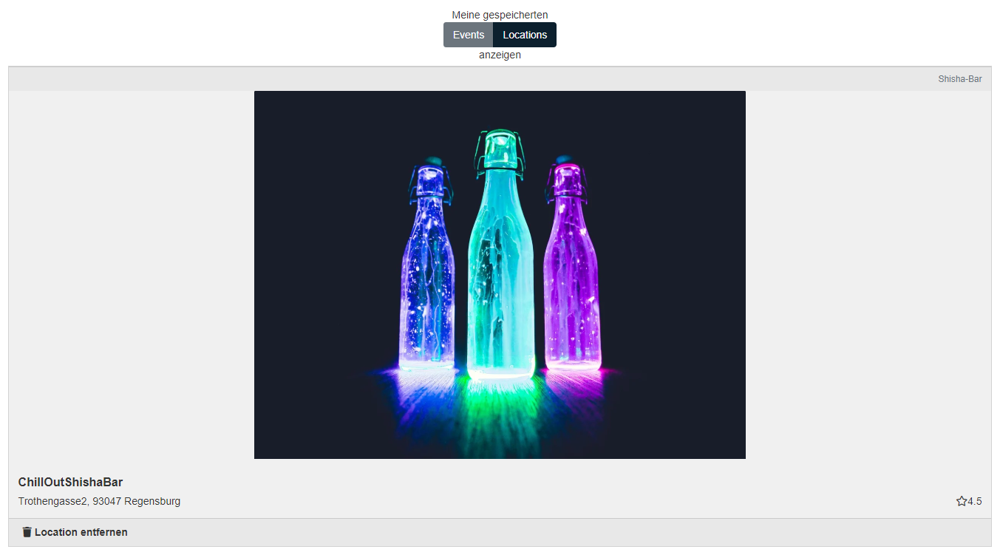
 

### Footer:

Im Footer unserer Seite wurden **(fiktive)** Kontaktinformationen und Informationen über uns und unsere Seite hinterlegt. Außerdem wurden der Vollständigkeit halber ein Links zu Impressum, AGB & Datenschutz hinterlegt (Diese wurden jedoch nicht weiter ausgearbeitet!). Die Fußzeile des Footers beinhaltet Links zu den Social Media Plattformen unserer Seite. (Es wurden nur die Startseiten der Plattformen hinterlegt, da wir keine solchen Seite betreiben.)  
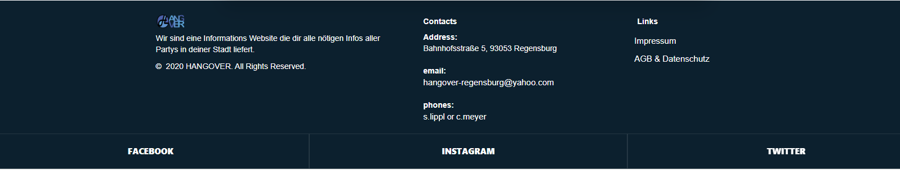
 

